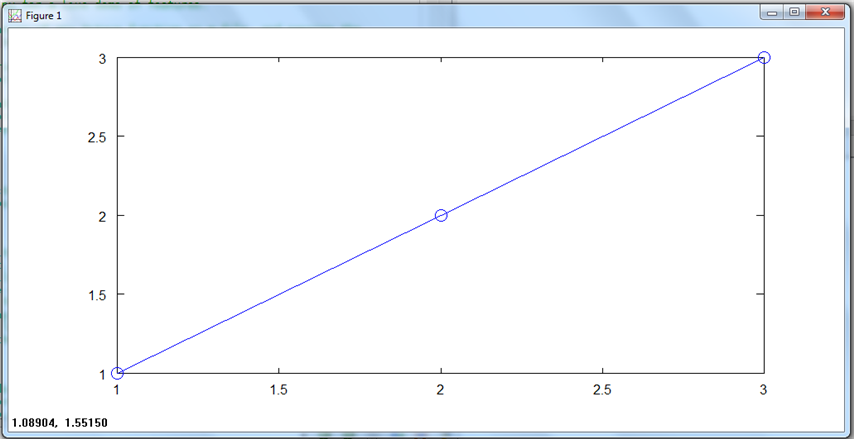
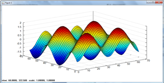

***********
Oct2py Demo
***********

Output of oct2py demo script, showing most of the features of the library.  Note that the two
plot commands will generate a plot in the actual demo.
To run interactively::

   >>> import oct2py
   >>> oct2py.demo()

::

   oct2py demo
   ********************
   >>> import numpy as np
   >>> from oct2py import Oct2Py
   >>> oc = Oct2Py()
   >>> # basic commands
   >>> print oc.abs(-1)
   1
   >>> print oc.upper('xyz')
   XYZ
   >>> # plotting
   >>> oc.plot([1,2,3],'-o')
   Press Enter to continue...

::

   >>> xx = np.arange(-2*np.pi, 2*np.pi, 0.2)
   >>> oc.surf(np.subtract.outer(np.sin(xx), np.cos(xx)))
   Press Enter to continue...

::

   >>> # getting help
   >>> help(oc.svd)
   Help on function octave_command in module oct2py._oct2py

   octave_command(*args, **kwargs)
       `svd' is a function from the file c:\Programs\Octave\3.2.4_gcc-4.4.0\libexec\octave\3.2.4\oct\i686-pc-mingw32\svd.oct

	-- Loadable Function: S = svd (A)
	-- Loadable Function: [U, S, V] = svd (A)
	    Compute the singular value decomposition of A

		 A = U*S*V'

	    The function `svd' normally returns the vector of singular values.
	    If asked for three return values, it computes U, S, and V.  For
	    example,

		 svd (hilb (3))

	    returns

		 ans =

		  1.4083189
		  0.1223271

   >>> # single vs. multiple return values
   >>> print oc.svd(np.array([[1,2], [1,3]]))
   [[ 3.86432845]
    [ 0.25877718]]
   >>> U, S, V = oc.svd([[1,2], [1,3]])
   >>> print U, S, V
   [[-0.57604844 -0.81741556]
    [-0.81741556  0.57604844]] [[ 3.86432845  0.        ]
    [ 0.          0.25877718]] [[-0.36059668 -0.93272184]
    [-0.93272184  0.36059668]]
   >>> # low level constructs
   >>> oc.run("y=ones(3,3)")
   >>> print oc.get("y")
   [[ 1.  1.  1.]
    [ 1.  1.  1.]
    [ 1.  1.  1.]]
   >>> oc.run("x=zeros(3,3)", verbose=True)
   x =

	   0        0        0
	   0        0        0
	   0        0        0

   >>> x = oc.call('rand', 1, 4)
   >>> print x
   [[ 0.50262697  0.10625378  0.29291054  0.00816869]]
   >>> t = oc.call('rand', 1, 2, verbose=True)
   a__ =

     0.68279  0.43020

   >>> y = np.zeros((3,3))
   >>> oc.put('y', y)
   >>> print oc.get('y')
   [[ 0.  0.  0.]
    [ 0.  0.  0.]
    [ 0.  0.  0.]]
   >>> from oct2py import Struct
   >>> y = Struct()
   >>> y.b = 'spam'
   >>> y.c.d = 'eggs'
   >>> print y.c['d']
   eggs
   >>> print y
   {'c': {'d': 'eggs'}, 'b': 'spam'}
   ********************
   DEMO COMPLETE!
