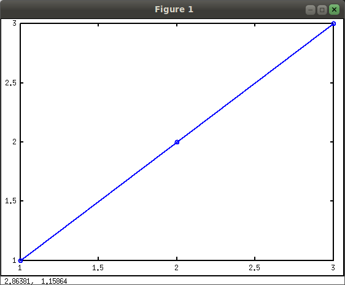
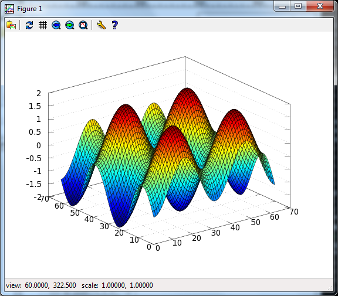

# Demo

Output of Oct2Py demo script, showing most of the features of the
library. Note that the two plot commands will generate an interactive
plot in the actual demo. To run interactively:

```pycon
>>> #########################
>>> # Oct2Py demo
>>> #########################
>>> import numpy as np
>>> from oct2py import Oct2Py
>>> oc = Oct2Py()
>>> # basic commands
>>> print(oc.abs(-1))
1.0
>>> print(oc.upper("xyz"))
XYZ
>>> # plotting
>>> oc.plot([1, 2, 3], "-o", "linewidth", 2)  # doctest: +SKIP
Press Enter to continue...
```



```pycon
>>> oc.close()
1.0
>>> xx = np.arange(-2 * np.pi, 2 * np.pi, 0.2)
>>> oc.surf(np.subtract.outer(np.sin(xx), np.cos(xx)))  # doctest: +SKIP
Press Enter to continue...
```



```pycon
>>> oc.close()
1.0
>>> # getting help
>>> help(oc.svd)  # doctest: +SKIP
>>> # single vs. multiple return values
>>> print(oc.svd(np.array([[1, 2], [1, 3]])))
[[3.86432845]
 [0.25877718]]
>>> U, S, V = oc.svd([[1, 2], [1, 3]], nout=3)
>>> print(U, S, V)
[[-0.57604844 -0.81741556]
 [-0.81741556  0.57604844]] [[3.86432845  0.        ]
 [0.          0.25877718]] [[-0.36059668 -0.93272184]
 [-0.93272184  0.36059668]]
>>> # low level constructs
>>> oc.eval("y=ones(3,3)")
y =
   1   1   1
   1   1   1
   1   1   1
>>> print(oc.pull("y"))
[[1.  1.  1.]
 [1.  1.  1.]
 [1.  1.  1.]]
>>> oc.eval("x=zeros(3,3)", verbose=True)
 x =
   0   0   0
   0   0   0
   0   0   0
>>> t = oc.eval("rand(1, 2)", verbose=True)  # doctest: +SKIP
 ans =
   0.2764   0.9381
>>> y = np.zeros((3, 3))
>>> oc.push("y", y)
>>> print(oc.pull("y"))
[[0.  0.  0.]
 [0.  0.  0.]
 [0.  0.  0.]]
>>> from oct2py import Struct
>>> y = Struct()
>>> y.b = "spam"
>>> y.c.d = "eggs"
>>> print(y.c["d"])
eggs
>>> print(y)
 {'b': 'spam', 'c': {'d': 'eggs'}}
>>> #########################
>>> # Demo Complete!
>>> #########################
```
